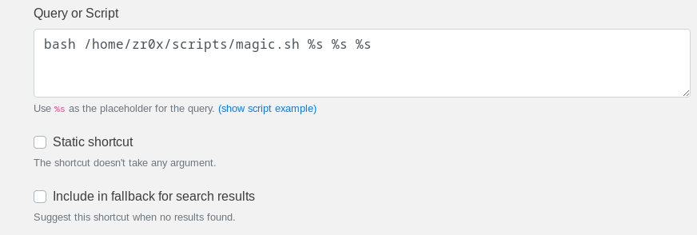

# sendCv.py - CV Sender

## Introduction

`sendCv.py` is a Python script designed to facilitate sending job application emails with a CV attachment. It allows users to specify recipient email addresses, email subjects, and CV attachments directly from the command line.

## GIF


## Why Use `sendCv.py`?

- **Simplicity:** Easily send personalized job application emails with just a few command-line arguments.
- **Flexibility:** Specify recipient email, subject, and CV attachment path dynamically.
- **Automation:** Integrate into scripts or automated workflows for repetitive tasks.

## How to Set Up

### Prerequisites

- Python 3 installed on your system.
- `pip` installed to manage Python packages.
- Gmail account (or another SMTP-enabled email provider) for sending emails.

### Installation Steps

1. **Clone the Repository:**
   ```sh
   git clone https://github.com/durge5h/DailyTasksAutomation.git
   cd DailyTasksAutomation/sendCv
   ```

2. **Install Required Packages:**
   ```sh
   pip install -r requirements.txt
   ```

3. **Set Up Environment Variables:**

   - Create a `.env` file in the project directory with your email credentials:
     ```sh
     echo "EMAIL=your_email@gmail.com" > .env
     echo "EMAIL_PASSWORD=your_email_password" >> .env
     ```
     Replace `your_email@gmail.com` with your Gmail address and `your_email_password` with your Gmail password or an application-specific password if using 2-factor authentication.

4. **Make the Script Executable:**
   ```sh
   chmod +x sendCv.py
   ```

5. **Create a Symbolic Link (Optional):**
   If you want to run the script without specifying `.py` extension:
   ```sh
   ln -s /path/to/your/sendCv.py /usr/local/bin/sendCv
   ```
   
### Usage

#### Command-Line

##### Switches:

- **`-r`, `--recipient_email`** (required)
  - The recipient's email address.
  - Example: `-r hr@example.com`

- **`-s`, `--subject`** (optional)
  - The subject of the email. If not provided, the default subject "Job Application for [Position]" is used.
  - Example: `-s "Application for Senior Security Engineer"`

- **`-a`, `--attachment`** (optional)
  - The path to your CV file. If not provided, it defaults to the path based on the job position.
  - Example: `-a /path/to/your/CV.pdf`

- **`-p`, `--position`** (optional)
  - The job position you are applying for. If not provided, it defaults to "Pentester".
  - Example: `-p "Security Engineer"`

#### Example Commands:

1. **Send CV with all specified parameters:**
   ```sh
   python sendCv.py -r hr@example.com -s "Job Application for Pentester" -a "/path/to/CV.pdf" -p "Pentester"
   ```

2. **Send CV with default subject and attachment based on position:**
   ```sh
   python sendCv.py -r hr@example.com -p "Security Engineer"
   ```

3. **Send CV with only recipient email, using all defaults:**
   ```sh
   python sendCv.py -r hr@example.com
   ```

#### Ulauncher

If you wan to use script with [Ulauncher](https://www.google.com/url?sa=t&source=web&rct=j&opi=89978449&url=https://ulauncher.io/&ved=2ahUKEwjo16DS8pKHAxWHzjgGHW8cDyAQFnoECAcQAQ&usg=AOvVaw2PQUwvfoS-BIrBxntROWVQ) then you can use **magic.sh** file and make shortcut in ulauncher like this.



> To make it work you should have have v6.0.0-beta14 i.e. Beta version as v5.15.7 has some issue with passing argument
> With this setting you will only able to parse email and position, you can edit the Query or Script in Ulauncher and magic.sh to your need. 

## Google authorization 

When sending emails through a Python script using Gmail, there are a few reasons why authorization might fail. Here are some common issues and solutions:

1.  **Less Secure App Access**: Google blocks sign-in attempts from apps that do not meet certain security standards. If you are using your primary Google account, this might be the issue.
    
    **Solution**: Enable access for less secure apps. Note that Google plans to phase out this feature, so it might not be available for long.
    
    -   Go to your [Google Account settings](https://myaccount.google.com/).
    -   Navigate to the "Security" tab.
    -   Scroll down to "Less secure app access" and enable it.
2.  **App Passwords**: If you have 2-Step Verification enabled on your Google account, you need to use an App Password instead of your regular password.
    
    **Solution**: Generate an App Password.
    
    -   Go to your [Google Account settings](https://myaccount.google.com/).
    -   Navigate to the "Security" tab.
    -   Under "Signing in to Google," select "App passwords."
    -   Select the app and device you want to generate the app password for, and follow the instructions.
    -   Use this generated password in your Python script.

## Security Concerns

### Secure Handling of Email Credentials


By leveraging HashiCorp Vault or a similar secure vault solution, you can significantly enhance the security of your Python script (`sendCv.py`) by centralizing and securing credential management. This approach mitigates the risks associated with storing credentials in environment variables and ensures compliance with security best practices.

---
<h4>Feel free to further customize the content as needed!<h4>
